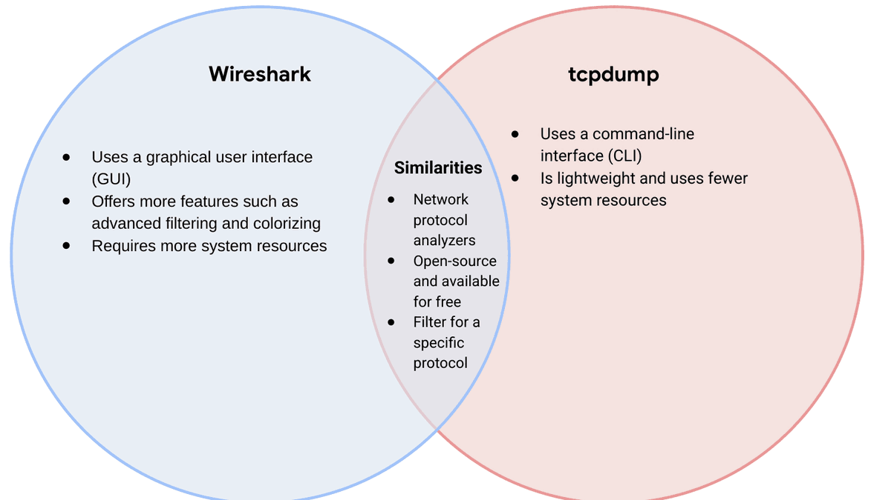

# Wireshark and tcpdump: Packet Analysis Tool Comparison

## Project Overview

This project compares Wireshark and tcpdump, two open-source tools used to capture and analyze network traffic. Both tools support protocol filtering and packet inspection, but their interfaces and resource requirements make them useful in different operating environments.



## Comparison Summary

| Area | Wireshark | tcpdump |
|---|---|---|
| Interface | Graphical user interface | Command-line interface |
| Primary strength | Detailed interactive inspection and visual analysis | Fast, lightweight capture and filtering |
| Resource use | Generally requires more memory and processing resources | Uses fewer system resources |
| Filtering | Display and capture filters with visual feedback | Berkeley Packet Filter syntax for command-line capture |
| Visualization | Protocol trees, packet coloring, conversations, and statistics | Text output suitable for terminals, scripts, and pipelines |
| Remote systems | Less convenient on servers without a desktop environment | Well suited to remote and headless systems |
| Automation | Useful for manual investigation and export workflows | Easily incorporated into scripts and command pipelines |
| Output files | Reads and writes standard capture formats such as PCAP and PCAPNG | Captures traffic to PCAP files for later analysis |

## Shared Capabilities

Both tools:

- Capture and inspect network packets.
- Analyze common network protocols.
- Filter traffic to focus on relevant packets.
- Support open-source network investigation workflows.
- Save packet captures for later review.
- Help analysts troubleshoot connectivity and investigate suspicious traffic.

## Wireshark

Wireshark provides a graphical environment for detailed packet inspection. Analysts can expand protocol layers, follow conversations, apply display filters, color-code traffic, and review statistics without interpreting every packet only as terminal text.

### Best uses

- Detailed investigation of a saved capture
- Learning protocol structures and packet fields
- Following TCP or application conversations
- Reviewing DNS, HTTP, ICMP, and other protocols visually
- Building screenshots and evidence for reports

### Tradeoffs

- Requires a graphical environment for its standard interface.
- Uses more system resources than a lightweight command-line capture tool.
- Large captures can become difficult to navigate without careful filtering.
- Capturing live traffic may require elevated permissions or properly configured capture privileges.

## tcpdump

tcpdump captures and displays packets directly from the command line. Its small footprint makes it practical for servers, remote systems, containers, and incident-response situations where a graphical desktop is unavailable.

### Best uses

- Capturing traffic on a remote or headless server
- Quickly confirming whether packets reach an interface
- Filtering traffic during command-line investigations
- Writing PCAP files for later Wireshark analysis
- Adding packet capture to scripts and operational workflows

### Tradeoffs

- Detailed analysis requires comfort with command syntax and packet fields.
- Terminal output provides less visual context than Wireshark.
- Complex investigations may be easier after opening the saved capture in Wireshark.

## Example Workflow

A practical investigation can use both tools:

1. Capture focused traffic on a remote Linux server with tcpdump.
2. Save the packets to a PCAP file.
3. Transfer the capture through an approved secure process.
4. Open it in Wireshark for deeper protocol analysis.
5. Document findings while preserving the original capture as evidence.

Example tcpdump capture:

```bash
sudo tcpdump -i eth0 -nn -w investigation.pcap
```

Focused example for DNS traffic:

```bash
sudo tcpdump -i eth0 -nn port 53 -w dns-traffic.pcap
```

Equivalent Wireshark display filter after opening the capture:

```text
dns
```

## Tool Selection Guide

| Situation | Recommended Starting Tool | Reason |
|---|---|---|
| Remote server with no desktop | tcpdump | Works directly in a terminal and uses few resources. |
| Deep analysis of a saved capture | Wireshark | Provides protocol trees, visual filtering, and conversation analysis. |
| Quick live connectivity check | tcpdump | Starts quickly and displays matching packets immediately. |
| Training and protocol learning | Wireshark | Makes packet layers and fields easier to explore. |
| Automated collection | tcpdump | Integrates naturally with shell scripts and scheduled workflows. |
| Formal evidence screenshots | Wireshark | Produces readable views for technical documentation. |

## Security and Evidence Considerations

- Obtain authorization before capturing network traffic.
- Limit collection to the systems, interfaces, protocols, and time window required.
- Packet captures may contain credentials, personal data, session tokens, or confidential content.
- Store captures securely and restrict access according to their sensitivity.
- Hash evidence files and record collection details when chain of custody matters.
- Avoid changing the original capture during analysis. Work from a verified copy when appropriate.
- Stop collection once the investigation objective has been met to reduce unnecessary data exposure.

## Key Takeaways

- Wireshark and tcpdump complement each other rather than competing for every use case.
- tcpdump is effective for lightweight capture and terminal-based troubleshooting.
- Wireshark is effective for detailed visual investigation and reporting.
- Filters reduce noise and help analysts collect only relevant traffic.
- PCAP compatibility allows analysts to capture with one tool and investigate with the other.

## Skills Demonstrated

- Network-analysis tool selection
- Packet-capture workflow planning
- Wireshark and tcpdump comparison
- Capture and display filter concepts
- Evidence-handling considerations
- Technical diagram interpretation
- Security documentation

## Project Note

This portfolio project is based on a cybersecurity training diagram. The expanded comparison, workflow, and security analysis were prepared as an original professional summary.
